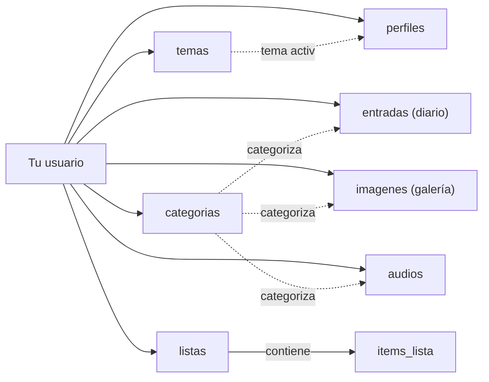

# Base de datos de Cuarto Propio

> Explicación de referencia del esquema de Supabase/Postgres. El esquema en sí vive como código en `supabase/migrations/` — este documento explica *por qué* está armado así, para no tener que re-derivarlo en cada sesión.

## Resumen: cómo está pensada la base

Cuarto Propio usa **PostgreSQL vía Supabase**. Hoy la usás una sola persona, pero la base está armada para que, si el proyecto pasa a tener varios usuarios (Fase 2), **no haya que tocar ni una tabla**.

La idea central es simple: **todo lo que creás cuelga de tu usuario**. Cada tabla de contenido (`entradas`, `listas`, `imagenes`, `audios`, `categorias`, `temas`) tiene una columna `usuario_id`, y Postgres mismo —no el código de la app— se encarga de que nadie vea ni toque filas que no son suyas. Eso se llama **Row Level Security (RLS)** y se explica en detalle más abajo.

En números: son **8 tablas**, repartidas en tres grupos:

| Grupo | Tablas | Para qué |
| --- | --- | --- |
| Identidad | `perfiles` | Tu perfil (nombre, foto, tema activo) |
| Contenido | `entradas`, `listas` + `items_lista`, `imagenes`, `audios` | Lo que vas creando en cada módulo |
| Organización | `categorias`, `temas` | Cómo se agrupa y personaliza ese contenido |

Todo el esquema vive versionado como código en `supabase/migrations/` — cada archivo `.sql` es un paso que se aplica en orden, nunca se edita uno viejo (el detalle está en la última sección).

## Cómo se relacionan las tablas



Todo nace de **tu usuario** (línea llena): cada tabla de contenido tiene una fila por cada cosa que creás, marcada con tu `usuario_id`. Las líneas punteadas son relaciones opcionales: una entrada, una imagen o un audio *pueden* tener categoría, pero no es obligatorio. La única relación de "contiene" real es `listas` → `items_lista`: si borrás una lista, sus ítems se borran con ella.

## Las tablas, una por una

### `perfiles`

Extiende la tabla de usuarios de Supabase Auth con datos propios del producto. Tiene el mismo `id` que tu usuario de Auth (no uno nuevo).

| Columna | Qué guarda |
| --- | --- |
| `id` | Tu id de usuario (el mismo de Supabase Auth) |
| `nombre` | Tu nombre |
| `foto_perfil_path` | Ruta del archivo de tu foto de perfil en Storage |
| `tema_activo_id` | Qué fila de `temas` está activa ahora |

Se crea sola la primera vez que te registrás (ver "Lo que la base hace sola" más abajo).

### `categorias`

Tus propias categorías —no hay categorías globales compartidas entre usuarios—, usadas por el Diario, la Galería y el Audio.

| Columna | Qué guarda |
| --- | --- |
| `id` | Identificador único |
| `nombre` | El nombre que le pusiste (único por usuario: no podés repetir "Viajes" dos veces) |

No tienen pantalla propia de gestión: se crean solas cuando escribís un nombre nuevo al guardar una entrada, imagen o audio.

### `entradas` — el Diario

| Columna | Qué guarda |
| --- | --- |
| `titulo` | Título de la entrada (opcional) |
| `contenido` | El texto enriquecido completo, como JSON de Tiptap (formato, colores, listas, todo) |
| `contenido_texto` | El mismo texto pero en plano, sin formato — se usa solo para buscar |
| `busqueda` | Columna calculada automáticamente a partir de `contenido_texto`, para la búsqueda por palabra clave |
| `categoria_id` | A qué categoría pertenece (opcional) |
| `fecha` | Fecha de la entrada (por default, cuándo la creaste) |

`contenido` es la fuente de verdad (lo que ves en el editor); `contenido_texto` y `busqueda` existen solo para que la búsqueda funcione rápido, sin tener que leer el JSON de Tiptap cada vez.

### `listas` e `items_lista`

Las listas son checklists simples: un nombre, y adentro, ítems con texto + marcado.

| Tabla | Columna | Qué guarda |
| --- | --- | --- |
| `listas` | `nombre` | El nombre de la lista ("Libros leídos") |
| `items_lista` | `lista_id` | A qué lista pertenece |
| `items_lista` | `contenido` | El texto del ítem |
| `items_lista` | `marcado` | Si está tildado o no |
| `items_lista` | `orden` | Su posición dentro de la lista |

Los ítems no tienen `usuario_id` propio —se sabe de quién son a través de su lista—, y por eso se explican distinto en la sección de seguridad.

### `imagenes` — la Galería

| Columna | Qué guarda |
| --- | --- |
| `titulo`, `descripcion` | Lo que escribiste al subir la foto |
| `hashtags` | Lista de hashtags (para filtrar la cuadrícula) |
| `miniatura_path`, `completa_path` | Las dos versiones que genera `sharp` al subir: una liviana para la cuadrícula, una grande para el detalle |
| `ancho`, `alto` | Dimensiones de la imagen |
| `categoria_id` | Categoría opcional |

### `audios`

| Columna | Qué guarda |
| --- | --- |
| `archivo_path` | Ruta del archivo de audio en Storage |
| `duracion_segundos` | Duración de la nota |
| `transcripcion` | Texto transcripto (no se usa en Fase 1, queda listo para Fase 2) |
| `categoria_id` | Categoría opcional |

### `temas`

Guarda tu personalización visual. Hoy solo se usa el color básico; el resto (cursor, iconos, tipografía) está en la tabla desde ya para no migrar nada cuando se construya en Fase 2.

| Columna | Qué guarda |
| --- | --- |
| `nombre` | Nombre del tema ("Mi tema") |
| `colores` | Paleta de colores, como JSON |
| `cursor` | Cursor del mouse elegido |
| `iconos` | Set de iconos, como JSON |
| `tipografia` | Tipografía elegida |

## Seguridad: Row Level Security

Cada tabla tiene **RLS activado**, con una regla del tipo:

```sql
create policy "entradas: dueño" on public.entradas
  for all using (usuario_id = auth.uid())
  with check (usuario_id = auth.uid());
```

Esto significa que Postgres filtra **siempre**, en cada consulta, sin excepción: si intentás leer, editar o borrar una fila que no es tuya, la base se comporta como si esa fila no existiera. No depende de que el código de Next.js se acuerde de agregar un `WHERE usuario_id = ...` —ni siquiera si hubiera un bug en la app, alguien podría ver contenido ajeno.

Una excepción: `items_lista` no tiene `usuario_id` propio, así que su regla verifica el dueño a través de la lista a la que pertenece:

```sql
using (exists (
  select 1 from public.listas
  where listas.id = items_lista.lista_id
    and listas.usuario_id = auth.uid()
))
```

Esto es lo que hace posible la Fase 2 sin reescribir nada: el día que haya más de un usuario, estas mismas reglas siguen funcionando exactamente igual —cada quien sigue viendo solo lo suyo, automáticamente.

## Storage: dónde viven los archivos

Las fotos y los audios no se guardan en la base de datos —ahí solo vive la ruta (`miniatura_path`, `completa_path`, `archivo_path`). Los archivos en sí están en Supabase Storage, en dos buckets **privados**:

| Bucket | Contenido |
| --- | --- |
| `imagenes` | Miniatura + versión completa de cada foto |
| `audios` | Las notas de voz |

Privados quiere decir que no tienen una URL pública fija: para mostrarlos hay que pedirle a Supabase una URL firmada, que expira sola. La regla de quién puede leer/subir/borrar cada archivo es la misma idea que RLS, pero aplicada a la carpeta:

```sql
using (bucket_id = 'imagenes' and (storage.foldername(name))[1] = auth.uid()::text)
```

En la práctica esto obliga a que **todo archivo se guarde dentro de una carpeta con tu `usuario_id`** (por ejemplo `af3.../foto-1.webp`) —si se subiera fuera de esa carpeta, nadie podría leerlo, ni vos.

## Lo que la base hace sola

Dos automatizaciones, para no depender de que la app se acuerde de hacerlas:

**Perfil automático.** Cuando te registrás en Supabase Auth, un trigger crea tu fila en `perfiles` al toque —nunca hay un usuario sin perfil.

```sql
create trigger on_auth_user_created
  after insert on auth.users
  for each row execute function public.handle_new_user();
```

**`updated_at` al día.** En `entradas` y `perfiles`, cada vez que editás algo, un trigger actualiza `updated_at` solo. Así no hace falta que el código de la app mande esa fecha a mano en cada guardado (y no se puede olvidar de hacerlo).

## Cómo funciona la búsqueda por palabra clave

El contenido del Diario se guarda como JSON de Tiptap (formato, colores, listas...), y Postgres no puede buscar texto dentro de eso directamente. La solución es guardar el mismo contenido dos veces, con dos propósitos distintos:

1. **`contenido`** (JSON) —lo que ves y editás en el editor. Es la fuente de verdad.
2. **`contenido_texto`** (texto plano) —se calcula automáticamente a partir del JSON cada vez que guardás una entrada, usando la función `generateText` de Tiptap.
3. **`busqueda`** —una columna que Postgres genera solo, a partir de `contenido_texto` y el título, optimizada para búsqueda (`tsvector`, con un índice `GIN` para que sea rápida incluso con muchas entradas).

```sql
busqueda tsvector generated always as (
  to_tsvector('spanish', coalesce(titulo, '') || ' ' || coalesce(contenido_texto, ''))
) stored;
```

Cuando buscás "calma" en el Diario, la consulta compara contra `busqueda`, no contra el JSON —por eso es instantáneo aunque tengas cientos de entradas. Usé el diccionario `'spanish'` de Postgres, así que entiende acentos y variaciones.

## Las migraciones: qué hace cada archivo

El esquema no se edita a mano en el dashboard de Supabase —vive como archivos `.sql` en `supabase/migrations/`, que se aplican en orden y nunca se modifican una vez creados (un cambio nuevo es siempre un archivo nuevo).

Hoy es un solo archivo: `0001_esquema_completo.sql`, que crea las 8 tablas (con `categoria_id` en listas y `titulo` en audios ya incluidos, no como parche aparte), sus relaciones e índices, la búsqueda por palabra clave (`contenido_texto` + `busqueda`), RLS con sus políticas, el trigger que crea el perfil al registrarte, `updated_at` automático, y los buckets de Storage (`imagenes`, `audios`) con sus políticas de acceso por carpeta. El proyecto todavía no corrió contra una base de datos real, así que no hacía falta mantener el historial de pasos intermedios en el que se fue armando.

De acá en adelante, cualquier cambio de esquema (por ejemplo al construir Galería o Personalización) se agrega como un archivo nuevo (`0002_...`, `0003_...`), nunca editando este.

Para aplicarlo en un proyecto de Supabase nuevo: con la Supabase CLI, `supabase db push`; o pegando el archivo en el SQL Editor del dashboard. El detalle de setup completo está en el `README.md` del repositorio.
